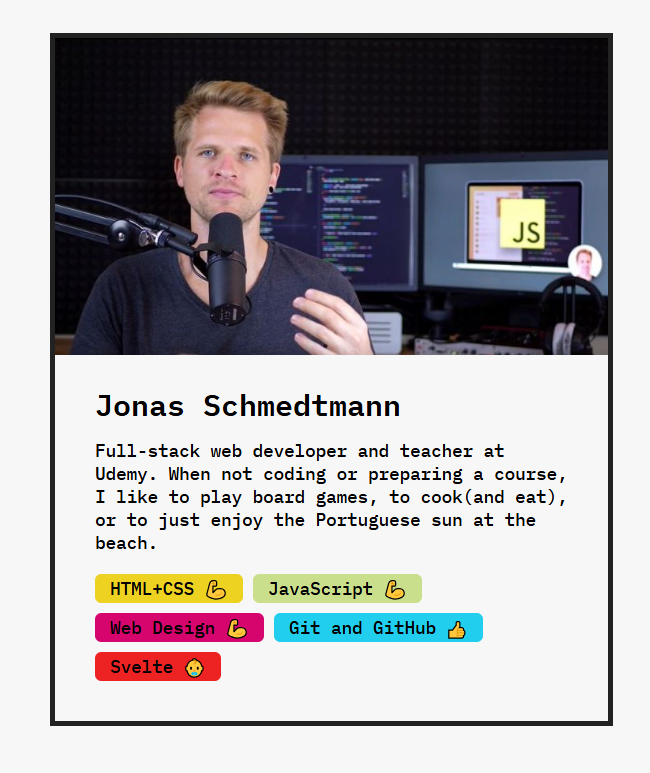

# Profile Cart V1: React Challenge

A small project from Jonas Schmedtmann’s React course.  
The focus of this challenge is learning how to:

- Create and use **functional components**
- Pass and handle **props**
- Work with **JSX** syntax




## Run the project

```bash
npm install
npm start
```
